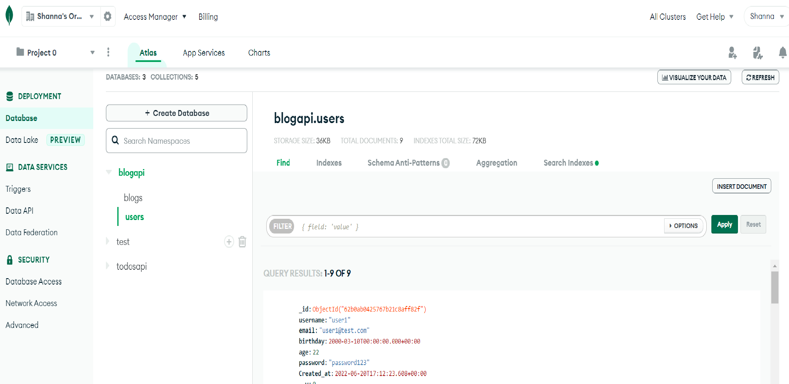
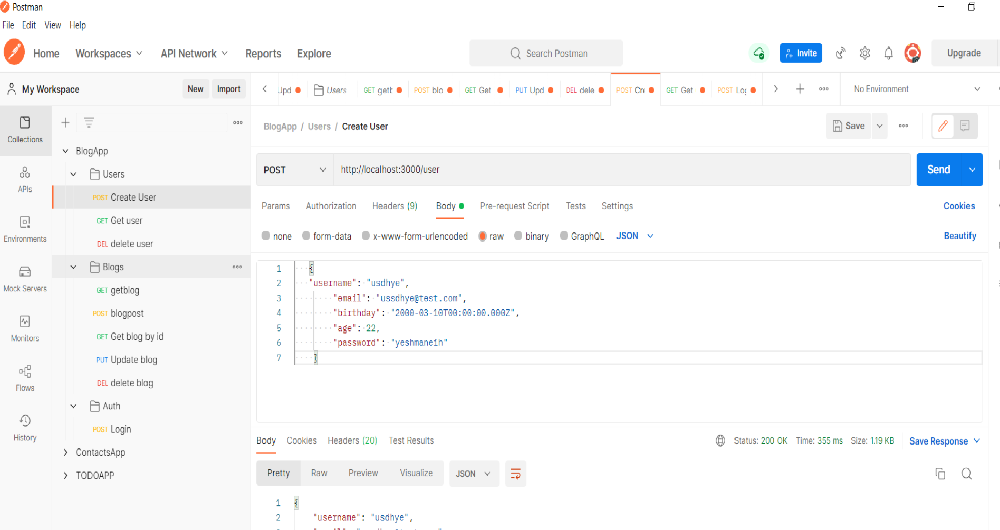

## Installation:
No Installation needed. Web app.
## Blogapi:
This is a finance blog Api is just a backend database created for storage of users. Api just the middleman connecting and communicating the backend with the front end.

## Dependencies:
bcrypt, dotenv, express, jsonwebtoken, mongoose, morgan, helmet.

## Main Features

## Demo

